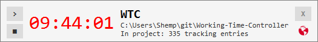
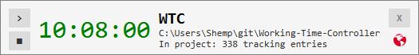

# Working time controller
> "Employ thy time well, if thou meanest to get leisure" © **Benjamin Franklin**

### About the application

This is a simple appication for tracking time which you spend to work _(even if you are not a programmer)_

The feature of this application is that it can work in two modes:
* **Without control**: app will track modifications of files and folders in specified directory by it-self  
  This can be useful when you need to do a lot of machine work connected with changing of files and folders.  
  (After some actions timer will remain active for some time)
  
* **Manual start/stop**: you are able to run/stop timer by click on proper button  
  This can be useful when you're working but don't changing files (thinking over something, for example)
  
### Preview interface

_Interface of this application is quite simple_

1. When you started application, you'll see something like this:

  
In this state you just can **open** manager of projects and select project, 
**connect** to the server (planet sign) or **close** application (cross sign)

2. After you choosen project in manager and when timer is not active, 
you will see as the picture bellow:

  
Here you're able to switch on manual mode (buttons **>** and **■** on the left) 

3. And timer will be lighted green in active state:

  
Each second the value on timer will increase

When you closed appication all properties would be saved in file `.projects` in user's home directory  
(make sure that it's available to write)

### How to run application

> I apologize for such _perverted_ method of running

Due to I have several projects that use some `utils` 
I made special library for myself and didn't public it as artiact in `Maven`.
So this library can't be added as dependency in `pom.xml` file and you need to 
download and add to classpath `jar` file in your IDE.

This library is available in `dependencies` directory (just clone it with repository)

1. When you added library to classpath just type `mvn clean package`
2. In `target` directory will be placed runnable `jar` file
3. Run it and use application

... or you can download already built `jar` file from [releases](https://github.com/Shemplo/Working-Time-Controller/releases)

### How to contribute to project

* **Fork** repository --> **make** changes --> **send** pull request _=-)_

### Terms of use

This is open source project under **Apache-2.0** license

* If you **use** it, please refer to this repository

* If you **like** it, please put a star ★ _=-)_
