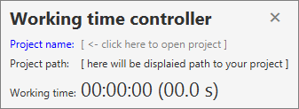
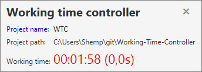
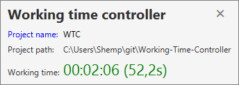

# Working time controller
> Simple controller of your working time

### How to use it

1. build project with `mvn clean package`
2. run built `jar` file in `target` directory
3. click on `Project name` and in opened window type path to the project directory
4. change something in project and see how your time is running

### Preview

| Project is not selected            | Project is not active              | Project is changed                |
|:----------------------------------:|:----------------------------------:|:---------------------------------:|
|  |  | |
